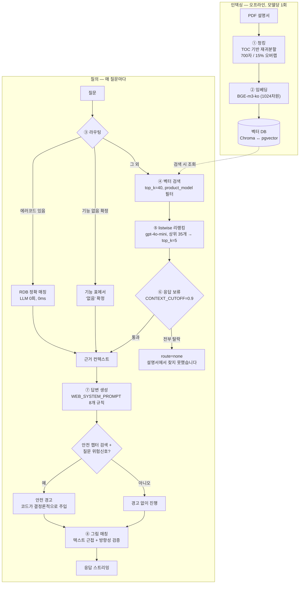

# 4. RAG 파이프라인

시스템 전체 구조는 [03-architecture.md](03-architecture.md)에 있다. 이 문서는 인덱싱부터 응답까지
**RAG 파이프라인 자체**의 각 단계에서 무엇을 선택했고 **왜 그렇게 했는지**를 다룬다.



## 4.1 청킹

`experiments/박형건_exp02.py` — 2026-09-18 팀 통합 베이스라인으로 채택.

| 항목 | 값 |
|---|---|
| 기본 전략 | PDF 내장 목차(TOC) 기반 재귀 분할 (`max_depth=2`) |
| 슬라이싱 | 700자 / 15% 오버랩 |
| 중복 헤딩 | 조상 경로 접두어로 구분 |
| 트러블슈팅 | 키워드 매칭으로 depth 무시하고 강제 세분화 |
| 손상 방어 | 한 섹션이 20쪽을 넘으면 TOC 손상으로 보고 1쪽으로 축소 |
| 폴백 | TOC 없으면 인쇄된 목차 파싱 → 실패 시 폰트 크기 기반 분할 |

**왜 목차 기반인가.** 설명서는 이미 "필터 청소하기", "고장 신고 전 확인하기"처럼 질문 단위에 가깝게
목차가 짜여 있다. 고정 길이로 자르면 이 경계를 무시하게 된다. 팀 실험에서 에어컨 기준 고정 1,200자
분할 대비 top-1 정확도가 83% → 90%로 올랐다.

**오버랩 실험.** 0% / 15% / 25% / 브레드크럼 접두어를 비교했고, 700자·15%가 가장 좋았다.
오버랩을 늘리면 같은 내용이 여러 청크에 중복돼 상위 후보를 잠식했다.

**손상 방어가 필요했던 이유.** 삼성 PDF 2개(`AC_AF19TX978MZ3N`, `RF_RH82M9152SL`)는 TOC 북마크가
손상돼 섹션 하나가 문서 전체를 삼켰다. 청크 하나가 100쪽이 되면 검색이 무의미해진다.

## 4.2 임베딩과 벡터 검색

| 항목 | 값 |
|---|---|
| 모델 | `dragonkue/BGE-m3-ko` (1024차원, 로컬 실행) |
| 벡터 DB | Chroma(로컬) / pgvector(공유) |
| 거리 | 제곱 L2 |
| 1차 검색 | `top_k=40`, `product_model` 필터 |

**모델 범위 필터가 핵심이다.** 등록 가전의 `product_model`로 검색 범위를 좁힌다. 이게 없으면 같은
제품군의 다른 모델 내용이 더 가깝게 나오는 일이 생긴다(스타일러 질문에 엉뚱한 모델의 표지 쪽이
근거로 잡힌 사례가 있었다).

**후보를 40개나 뽑는 이유.** 오프라인 측정에서 recall@5는 82.5%인데 recall@40은 99%였다. 1차 검색은
**놓치지 않는 것**이 목적이고, 걸러내는 일은 다음 단계인 리랭킹이 맡는다.

## 4.3 리랭킹

**pointwise CrossEncoder → listwise LLM으로 교체했다.**

| | 이전 | 현재 |
|---|---|---|
| 방식 | CrossEncoder(`bge-reranker-v2-m3`)로 후보마다 점수 | gpt-4o-mini에 후보 목록을 통째로 주고 순위 요청 |
| 후보 | RRF 병합 후 8개 | 거리순 상위 35개 |
| 결과 | top 3 | top 5 |

**교체 이유.** pointwise 방식은 후보를 서로 비교하지 않고 각각 점수를 매긴다. 그래서 어휘만 겹치는
오답에 정답보다 높은 점수를 주는 일이 반복됐다. listwise는 후보를 한 번에 놓고 고르므로 이 문제가
줄어든다. 97케이스 측정에서 94개가 정확히 맞았고 3개만 놓쳤다.

후보에게는 **청크 전문을 그대로 보여준다.** 200자로 자르면 700자 청크의 앞부분만 보게 되어 뒷부분에
정답이 있는 후보를 버리는 일이 생겼다.

## 4.4 라우팅 — 벡터 검색을 건너뛰는 경로

모든 질문을 벡터 검색으로 보내지 않는다. 확정적으로 답할 수 있는 질문은 DB에서 바로 답한다
(위 파이프라인 다이어그램의 ③ 라우팅 분기).

이 설계 덕분에 "dE 에러가 나고 문이 안 닫혀요" 같은 질문은 검색 없이 정확한 원인·조치와 제조사
사진까지 붙는다. 반대로 `dE`처럼 소문자로 시작하는 코드를 정규식이 못 잡으면 이 경로를 놓치고
일반 검색으로 빠지는데, 실제로 그 버그를 발견해 고쳤다.

## 4.5 응답 보류

벡터 검색은 관련 내용이 없어도 "그나마 가장 가까운 것"을 항상 반환한다. 그래서 두 단계로 거른다.

| 기준 | 값 | 동작 |
|---|---|---|
| `DISTANCE_CONFIDENT` | 0.85 | 이보다 가까우면 근거로 인정 |
| `DISTANCE_REJECT` | 1.25 | 이보다 멀면 무관한 것으로 보고 제외 |
| `CONTEXT_CUTOFF` | 0.9 | 리랭킹 후 이 값 이상이면 LLM 컨텍스트에서 제외 |

애매한 구간은 LLM에 관련성을 한 번 더 확인한다. 이렇게 걸러낸 결과가 하나도 없으면 `route=none`으로
"설명서에서 찾지 못했습니다"라고 답한다.

## 4.6 답변 생성

`WEB_SYSTEM_PROMPT`(`web/rag_service.py`)의 규칙 8개로 제어한다. 핵심 3개는 실사용 로그에서 발견한
결함을 직접 겨냥한다.

| 규칙 | 겨냥한 결함 |
|---|---|
| 근거가 여러 개면 질문에 맞는 것을 고르고, 다른 게 무관하다고 포기하지 말 것 | 근거 3개 중 3번째가 정답인데 "설명서에 없다"고 포기 |
| 고른 근거의 조치만 안내, 다른 증상의 조치를 섞지 말 것 | 다른 증상의 조치를 가져다 자신 있게 오답 |
| 방향·수치·버튼 이름은 원문 그대로 | "높게 설정돼 있는지 확인" → "높여보세요"로 뜻이 뒤집힘 |

**답변 풍부함.** 추상적인 지시("필요한 만큼 쓰세요")는 통하지 않았다. 나쁜 예/좋은 예를 프롬프트에
직접 넣으니 근거에 있는 확인 항목을 누락 없이, 이유와 함께 쓰기 시작했다. top_k를 3→5로 늘리는 것만으로는
개선되지 않았다(후보가 늘어도 답변은 오히려 짧아졌다).

## 4.7 안전 경고 — LLM에 맡기지 않는 부분

"사용 중지와 전원 차단을 먼저 하세요" 같은 경고는 **코드가 직접 붙이고 뗀다.**

```python
is_safety = needs_safety_warning(query, res)   # 안전 청크 검색됨 AND 질문에 위험 신호
if is_safety:
    yield SAFETY_WARNING_LINE                  # 코드가 주입
# 생성된 첫 문장이 경고 패턴인데 위 조건이 아니면 → 정규식으로 삭제
```

**왜 이렇게까지 하는가.** 프롬프트로 "이 문구를 쓰지 마라"고 3차례 다르게 지시했지만 LLM이 계속
자체 생성했다. 같은 질문을 4번 반복해 후보 선정이 100% 동일한데도 답변에만 경고가 나타나는 것을
확인하고, 검색이나 샘플링 문제가 아니라 생성 단계의 규칙 위반으로 결론 내렸다.

**조건도 좁혔다.** 처음에는 근거 청크에 "화재·감전" 같은 단어가 있으면 붙였는데, 이 단어들은 일반
설명 문장에도 흔해서 청소·필터 질문의 47%(141/300)에 경고가 붙었다. 지금은 **질문 자체에 위험 신호**
(타는 냄새, 연기, 스파크, 감전, 젖은 손, 가스 냄새 등)가 있을 때만 붙인다. 위험 질문 12개는 모두 감지하고
무해한 질문 12개는 오탐이 없다.

## 4.8 설명서 그림 매칭

답변의 각 단계 옆에 해당 그림을 붙인다. **LLM이 그림을 고르지 않는다.**

### 그림 검출

PDF를 렌더링해 글자를 지우고 남은 덩어리를 그림으로 본다(표·구분선·글상자 제외). 드로잉 객체를
직접 쓰지 않는 이유는, 그림에 붙은 흰색 마스크 도형 때문에 이웃 그림과 하나로 합쳐지기 때문이다.

우리 설명서의 그림은 대부분 **벡터 선화**다(LG 에어컨 83쪽 중 임베디드 이미지는 2개뿐, 벡터 도형이
많은 쪽은 63개). 그래서 "이미지 객체를 추출해 캡셔닝한다"는 일반적인 멀티모달 RAG 방식은 맞지 않는다.

### 그림 ↔ 답변 매칭

그림마다 이름표 후보를 만들고(앞 소제목 / 바로 위 글 / 좌우 같은 높이 글 / 아래 범례), 답변의 한 줄과
글자 4-gram이 충분히 겹칠 때만 붙인다. 못 찾으면 붙이지 않는다.

글자 매칭이 실패한 그림만 로컬 임베딩으로 한 번 더 비교하는데, 조건이 엄격하다.

- 유사도 0.80 이상
- 2위와 격차 0.15 이상
- 반대 동작 쌍(끄기/켜기, 넣기/꺼내기, 분리/조립)이 충돌하면 거부

세 번째 조건이 필요한 이유는 임베딩이 **동작의 방향을 구분하지 못하기** 때문이다. "제품을 끈 다음"과
"제품을 켜세요"가 유사도 0.81로 묶였다.

### 쪽 번호 보정

청크 메타데이터의 쪽 번호는 "섹션이 시작한 쪽"이라, 청크가 뒤쪽에 있으면 실제보다 1~5쪽 앞을 가리킨다.
무작위 378개를 검사해 117개(31%)가 틀린 것을 확인했다. 그래서 조회 시점에 청크 본문을 PDF 쪽
텍스트에서 찾아 보정한다(벡터 DB는 건드리지 않는다). 출처 카드의 쪽 번호와 PDF 링크도 이 값을 쓴다.

### 측정

| 항목 | 값 |
|---|---|
| 그림이 붙은 답변 | 122 / 300 (41%) |
| 정밀도 (무작위 28쌍 눈 검수) | 약 93~96% |

한계: 옅은 색이나 조각난 그림은 놓친다. 답변이 설명서 문장을 크게 바꿔 쓰면 매칭되지 않는다.

## 4.9 에러코드 사진

LG 고객지원 페이지의 사진을 에러코드 항목에 연결해 답변에 함께 보여준다. 대표 사진(표시부)은 첫
문장 뒤에, 본문 사진은 설명이 답변 줄과 맞을 때만 붙인다. 화면에는 항상 출처 링크를 표시한다.

## 관련 코드

| 단계 | 파일 |
|---|---|
| 청킹·벡터검색·리랭킹 | `experiments/박형건_exp02.py` |
| 라우팅 | `web/rag_myretriever.py` |
| 프롬프트·생성·안전경고 | `web/rag_service.py` |
| 그림 매칭 | `web/manual_figures.py` |
| 쪽 보정·PDF 경로 | `web/manual_pages.py` |
