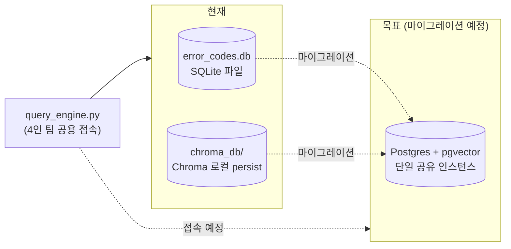
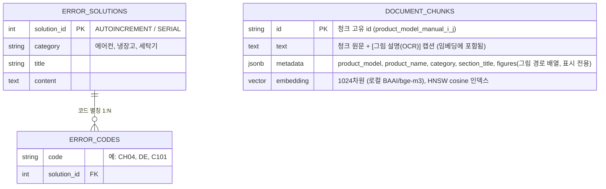

# DB 스키마 현황

이 프로젝트는 두 종류의 저장소를 쓴다 — 에러코드 RDB(정확 조회용)와 매뉴얼 청크 벡터DB(의미 검색용). 지금은 SQLite + Chroma로 따로 운영 중이고, Postgres + pgvector 단일 인스턴스로 옮기는 게 확정된 다음 단계다 (`docs/`의 DB 전략 논의 참고).

## 1. 물리 구조 — 현재 vs 목표

## 2. 논리 스키마 (ERD)

> **2026-09-11 변경 (임베딩/채팅 백엔드)**: OpenAI API 키 이슈로 임베딩 백엔드를
> `text-embedding-3-small`(1536차원, 유료)에서 로컬 `BAAI/bge-m3`(1024차원, 무료)로 전환했다.
> `.env`의 `EMBEDDING_BACKEND=local`. Chroma 컬렉션명도 `appliance_manuals_openai` →
> `appliance_manuals_local`로 바뀌어 기존 OpenAI 임베딩 데이터와 섞이지 않는다(차원이 다르면
> 애초에 같은 컬렉션에 못 들어감). **Postgres pgvector로 옮길 때 컬럼 타입은 `VECTOR(1536)`이
> 아니라 `VECTOR(1024)`로 만들 것** (팀 공유 문서인 "RDB×벡터DB 통합 가이드"에도 반영 필요).
> 채팅 백엔드도 같은 이유로 `CHAT_BACKEND=ollama` + `OLLAMA_MODEL=qwen3.5:9b`(로컬 설치됨)로
> 전환, 응답 지연 문제 때문에 `"think": false`로 고정(자세한 내용은 `query_engine.py`
> `_generate_ollama()` 주석 참고).

> **2026-09-11 변경 (그림/OCR 파이프라인 반영 후 재적재)**: `pipeline/figure_extractor.py`로
> 다이어그램 추출(벡터 잉크 비율 휴리스틱 + Tesseract OCR)과 SHA256 기반 전역 이미지 캐시를
> 추가하고, `pdf_chunker.py`의 청킹 로직(TOC 트리 기반 재귀 분할, 문제해결 섹션 강제 확장,
> 중복 제목 구분)을 전면 개편한 뒤 LG 30개 문서를 전부 재적재했다. 그림의 OCR 텍스트는
> `text` 필드에 직접 병합되어(벡터 검색에 걸림) 저장되고, 이미지 파일 경로는
> `metadata["figures"]`에만 들어가 답변 생성 시 "관련 그림" 표시용으로만 쓰인다 (임베딩
> 텍스트 자체에 경로 문자열이 섞이지 않도록 분리).

`ERROR_SOLUTIONS`/`ERROR_CODES`는 `db/error_codes_db.py`에 이미 구현·시딩되어 있고, `DOCUMENT_CHUNKS`는 지금은 Chroma 컬렉션 형태(암묵적 스키마)로 존재하며 Postgres 이전 시 실제 테이블로 승격될 예정이다. 세 테이블 사이에 외래키로 연결된 관계는 없다 — RDB와 벡터DB는 완전히 독립적인 두 검색 경로다 (`answer()`가 에러코드 언급 여부로 둘 중 하나를 고른다).

그림 파일 자체(`data/manual_figures/`)는 DB 컬럼이 아니라 로컬 디스크에 `{브랜드}/{카테고리}/{모델}/p{페이지}_*.png` 구조로 저장되고, `metadata["figures"]`가 그 경로를 가리키는 형태다 — Postgres 이전 시에도 이미지 자체를 DB에 넣지 않고 이 참조 방식을 유지할 계획(팀 3인의 실제 디렉토리 접근 전제, 향후 배포 시엔 오브젝트 스토리지 전환 검토 필요).

## 3. 현재 실데이터 현황

| 저장소 | 항목 | 값 |
|---|---|---|
| RDB (`error_codes.db`) | 총 항목 수 | 51건 |
| ㄴ LG | 26건 (에어컨 11 · 냉장고 5 · 세탁기 10) |
| ㄴ 삼성 | 25건 (에어컨 13 · 냉장고 4 · 세탁기 8) |
| 벡터DB (`chroma_db/`, 컬렉션 `appliance_manuals_local`) | LG 청크 수 | **3,022개** (에어컨 1,114 · 냉장고 689 · 세탁기 1,219) |
| ㄴ 그림(figures) 연결된 청크 수 | 1,638개 (전체의 약 54%, 표시 개수 상한 적용 후) |
| ㄴ 추출된 그림 총 개수 (`data/manual_figures/lg/`) | 1,095개 (임베디드 이미지 + 벡터 다이어그램 렌더링 페이지 합산) |
| 벡터DB (`chroma_db/`) | 삼성 청크 수 | **0개 (미적재 — 다음 작업, 새 청킹/그림 파이프라인 아직 미적용)** |

> 청크 수가 이전 기록(2,185개 → 2,407개 → 3,022개)으로 두 차례 더 늘어난 이유: ① 문제해결
> 섹션 강제 확장/긴 섹션 재귀 분할로 더 잘게 나뉨, ② 2026-09-11 Streamlit 데모 실사용 중
> 발견한 버그 수정(그림-페이지 느슨한 매칭 → 정확 매칭, 700자 슬라이싱에 15% 오버랩 추가,
> 문제해결 표를 증상 단위로 재분할)이 섹션 수를 늘림 — 전부 품질 개선이지 오류가 아니다.
> 자세한 비교와 실측 수치는 `docs/lg-chunking-strategy.md` "6번" 항목 참고. 회귀 테스트는
> `scripts_eval_retrieval.py`로 재현 가능(이번 세션 실사용 질문 4개 재사용).

## 4. 스코프 메모

- `symptom_class` 같은 카테고리 공통 폴백용 필드는 **의도적으로 포함하지 않음** — 미등록 모델 대응은 범위 밖으로 확정됐다 (`docs/category-fallback-db-strategy.md` 참고, 보류 처리됨).
- `metadata` 컬럼은 지금 필요한 필드(`product_model`, `product_name`, `category`, `section_title`, `figures`)만 담는다. 브랜드 구분은 별도 컬럼 없이 `product_model` 값 자체(모델명 접두사)로 충분히 구분 가능하다는 전제.
- `figures`는 그림이 있는 청크에만 존재하는 선택적(optional) 필드다 — 없는 청크가 더 많다는 전제로 조회 코드를 짜야 한다 (`metadata.get("figures", [])` 형태).
