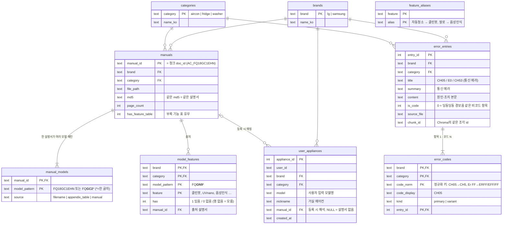

# LG 에어컨 챗봇 — 청킹·검색 전략, 쉽게 설명하기

> 이 문서는 RAG나 검색 기술을 잘 모르는 사람을 위해 씁니다.
> 실험 세부 수치와 코드 위치는 `docs/experiment_notes.md`, 실제 코드는 `notebook_lg_aircon.ipynb`에 있습니다.

---

## 0. 우리가 만들려는 것

사용자가 웹에서 **자기 에어컨 모델을 등록**해 두고, 챗봇에게

- "필터는 얼마나 자주 청소해요?" (사용법)
- "찬바람 나오다가 갑자기 멈춰요" (증상)
- "CH05 에러가 떴어요" (에러코드)

같은 질문을 하면, **그 모델의 사용설명서(PDF)에서 딱 맞는 부분을 찾아 근거로 답해주는** 서비스입니다.

AI(gpt-4o-mini)가 답을 쓰긴 하지만, 그 전에 **"설명서 어디를 읽고 답할지"를 찾아주는 단계**가 정확해야 합니다.
이 단계가 틀리면 AI는 엉뚱한 근거로 그럴듯한 답을 지어냅니다. 이 문서는 그 "찾는 단계"를 어떻게 설계했는지 설명합니다.

크게 두 가지입니다:

1. **청킹(Chunking)** — 설명서를 어떤 크기·단위로 잘라서 보관할 것인가
2. **검색(Retrieval)** — 질문이 들어왔을 때 잘라둔 조각 중 무엇을 골라 AI에게 줄 것인가

---

## 1. 청킹 — 설명서를 어떻게 잘랐나

### 왜 잘라야 하나

설명서 한 권은 5~6만 자입니다. AI에게 한 번에 다 줄 수 없으니(비용·길이 제한, 그리고 많이 줄수록 산만해짐)
**질문에 관련된 부분 몇 개만** 골라 줘야 합니다. 그러려면 미리 설명서를 조각(청크)으로 잘라 두어야 하고,
**어떻게 자르느냐가 답의 품질을 거의 결정합니다.**

### 처음 방식의 문제 — "1,200자마다 기계적으로 자르기"

가장 단순한 방법은 글자 수로 자르는 겁니다. 그런데 실제로 해보니:

```
[조각 A 끝부분]  … 극세 필터 • 물 세척 가능 • 2주에 한 번 권장 / 알러지케어 집진 필터 • 물 세척 불가능 •
[조각 B 앞부분]  12개월마다 필터 교체 / 38 / 관리하기 / 2 / 제품 뒷면에 있는 극세 필터의 손잡이를 …
```

- "필터 청소 주기" 표가 **두 조각으로 갈렸습니다.** "필터 얼마나 자주 청소해요?"에 대한 정답("2주에 한 번")은
  조각 A의 맨 끝에 있는데, 조각 A의 앞 900자는 전혀 다른 내용(UVnano 살균 설명)이라 검색에 잘 안 잡힙니다.
- "냄새 제거하기" 절이 "필터 교체 알림 초기화" 절 뒤에 붙어 한 조각이 됐습니다.
- `38 / 관리하기` 같은 **페이지 번호와 머리말**이 본문 중간에 박혀 잡음이 됐습니다.

비유하면, 책을 **문단이나 소제목 무시하고 정확히 30줄마다 찢어서** 보관한 셈입니다.

### 바꾼 방식 — "설명서의 목차대로 자르기"

LG 설명서 PDF에는 **북마크(목차)가 3단계로 내장**되어 있고, 10개 모델 전부에서 목차 제목이 본문의 줄과 글자 그대로
100% 일치한다는 걸 확인했습니다. 그래서 목차의 소제목을 경계로 잘랐습니다.

```
관리하기                          ← 1단계 (대챕터)
  └ 청소하기                      ← 2단계
      └ 필터 청소하기             ← 3단계   ★ 이게 조각 하나
      └ 팬 청소하기               ← 3단계   ★ 이것도 조각 하나
  └ 냄새 제거하기
      └ 냄새에 따른 제거 방법 알아보기   ★
```

이제 "필터 청소하기" 조각 하나에 청소 주기 표부터 분리 방법까지 **한 주제가 통째로** 들어갑니다.
사람이 설명서를 펴서 "필터 청소하기" 절을 읽는 것과 같은 단위입니다.

세 가지 특수 처리를 더 했습니다:

| 부분 | 처리 | 이유 |
|---|---|---|
| **고장 신고 전 확인하기 (문제 해결 표)** | 표를 표로 읽어서 **"증상 1개 = 조각 1개"** (원인·해결책 전부 포함) | 처음엔 "원인 1줄 = 조각 1개"로 잘랐더니, "와이파이가 안 돼요" 질문에 같은 증상의 원인 6개가 각각 따로 걸려서 검색 결과 3개가 전부 같은 증상의 조각 일부만 됐음. 합치니 한 조각에 원인 6개가 다 들어감 |
| **사용법 챕터** | 목차에 없는 4단계 소제목(아이스 쿨파워 냉방, 스마트 절전 냉방 …)까지 감지 | 부가기능들은 목차에 안 나오는데 각각 독립된 절차라서 |
| **에러코드** | 설명서에는 CH04, CH05 같은 코드가 **한 줄도 없음** → LG 고객지원 에러코드 자료(JSON)를 **항목 1개 = 조각 1개**로 별도 추가 | 이걸 안 넣으면 "CH05 떠요"에 답을 못 함 |

그 외: 페이지 번호·머리말 제거, 조각마다 "관리하기 > 청소하기 > 필터 청소하기" 같은 **경로 라벨**을 붙여 AI가 출처를 알 수 있게 함.

### 결과

같은 질문으로 전/후를 비교하면:

| 질문 | 전 | 후 |
|---|---|---|
| 필터 얼마나 자주 청소? | 정답이 2등 조각의 맨 끝에 묻힘 | 1등 조각이 청소 주기 표로 시작 |
| 이상한 냄새가 나요 | 1등 조각 앞부분이 "필터 교체 알림" | 1등이 "냄새 제거하기" 절 첫 줄부터 |
| 와이파이 안 돼요 | 원인 6개 중 3개만 AI에 전달 | 원인 6개 전부 한 조각 |

### 에어컨 → LG 전체 → 삼성으로 넓힐 때 무엇이 달랐나

같은 "목차대로 자르기" 전략이 60개 설명서 전부에 통했습니다. 브랜드별로 달라진 건 **"목차를 어떻게 믿나"** 와 **"고장 부분이 표인가 글인가"** 두 가지였습니다.

| | LG (프레임메이커, 30개) | 삼성 (InDesign, 30개) |
|---|---|---|
| 목차 북마크 | 27/30에 3단계로 내장 | 27/30에 내장. 소제목이 본문 줄과 거의 100% 일치 |
| 챕터 이름 | 11개로 통일 (`관리하기`, `고장 신고 전 확인하기` …) | 제품군·세대마다 다름 — 에어컨만 `문제해결` / `부록` / `기타편` 3계열 |
| 챕터 범위 잡는 법 | 챕터명이 **두 줄 연속 반복**되는 페이지 = 챕터 시작 | **목차 1단계의 페이지 번호**를 쓰되, 본문에서 제목 줄을 찾아 검증 (한 문서는 목차가 0페이지를 가리키는 등 깨져 있었음) |
| 챕터 역할 | 이름으로 정확히 | 키워드로: `고장·문제·점검` → 증상 파서, `주의·안전` → 안전, 나머지 → 목차 파서 |
| 고장 신고 부분 | 전부 표 `증상｜원인 및 해결책` | 세탁기·건조기·스타일러: 표 `증상｜확인/조치` + `코드｜진단｜해결방법`<br>에어컨·냉장고: **표 없는 글**. 증상 줄을 (a) 본문보다 큰 글씨(11pt vs 9.7pt) 또는 (b) `~나요!`로 끝나고 다음 줄이 불릿 으로 감지 |
| 에러코드 표 | 없음 (별도 JSON) | 있지만 **코드 셀이 이미지**라 글자가 안 나옴 → 진단·해결 글만 조각으로, 코드 조회는 SQLite가 담당 |
| 목차 없는 구형 | 3개: `7. 냉장실홈바` 같은 번호 소제목, 띄어쓰기 없는 PDF 1종 | 3개: 굵은 글씨를 안 써서 글자 크기 차이(+1pt)로 소제목, 띄어쓰기 없는 PDF 1종 |
| 결과 | 30개 → 2,800여 청크 | 30개 → 2,270여 청크 |

띄어쓰기가 빠진 PDF(`올바른냉장고사용방법`)는 kiwi 형태소 분석기의 띄어쓰기 복원으로 `올바른 냉장고 사용 방법`으로 되돌려 임베딩합니다.

**카테고리별로 나누지 않은 이유**: 템플릿 차이는 카테고리가 아니라 **브랜드·제작 시기**에 따라 갈렸습니다. 삼성 냉장고와 삼성 세탁기는 같은 규칙으로 잘리고, 삼성 에어컨 3계열은 서로 다릅니다. 그래서 파서는 브랜드 프로필 2개(`chunking.py` LG, `chunking_samsung.py` 삼성)이고 카테고리는 메타데이터일 뿐입니다.

### 이후 추가된 두 단계 (2026-09-17, 자체 테스트셋 266문항으로 검증)

- **③-b 동점 재정렬(listwise)** — 리랭커는 (질문, 조각)을 하나씩 따로 점수 매겨서 `먼지통 비우기`와 `먼지통 알림 초기화`처럼 둘 다 그럴듯한 조각을
  소수점 차로 갈랐습니다. 1·2등 점수 차가 0.10 미만이고 소제목이 다를 때만(전체의 21%) gpt-4o-mini에게 3개를 나란히 보여 순서를 다시 매기게 합니다.
  top-1 92.5 → 93.7%, 악화 0건. 규칙 기반 대조군(안전 어투면 안전 조각 가산)은 +2건이라 listwise를 택했습니다.
- **④ 근거 판정** — 관련도 컷(관련확률 10% 미만 제외) 후 근거가 0개면 `route=none`으로 "설명서에 없다"고만 답하고, 가까운 소제목을 화면에만 제안합니다.
  "같은 제품군 다른 모델 설명서로 대체"는 시험 후 뺐습니다 — `스팀 기능 있어요?`에 다른 모델 기준으로 "있다"고 답해서. 대신 **"X 기능 있어요?" 꼴은
  그 모델 설명서와 예상 질문 어디에도 X가 없으면 '없는 기능'**으로 답합니다(②의 일반화).
- 프롬프트에는 등록 가전(`LG 세탁기 F21VDSK`)을 명시하고, 수치는 문서 값만 쓰게 하며, 공용 설명서의 `19/21/24 kg`처럼 값이 여럿이면
  **코드가 모델명의 숫자(21)와 일치하는 값을 골라** 힌트로 넘깁니다 — LLM에 고르게 했더니 첫 값을 집었습니다.

---

## 2. 검색 — 질문에 맞는 조각을 어떻게 고르나

### 기본 아이디어: "뜻이 비슷한 것 찾기" (벡터 검색)

질문과 조각을 각각 숫자 목록(벡터)으로 바꿔서 **뜻이 가까운 것**을 찾습니다. "에어컨이 안 시원해요"와
"냉방을 켰는데 시원하지 않아요"는 단어가 달라도 뜻이 비슷하니 가깝게 나옵니다. 이 변환 모델로는 한국어 구어체를
잘 다루는 **bge-m3**를 씁니다.

여기까지만 해도 자체 테스트(63문항)에서 1등 정답률 83%, 3등 안 정답률 92%였습니다. 나쁘지 않지만 틀린 것들을 보니
유형이 있었습니다:

- **말이 달라서 못 찾음**: "말로 조작하려면?" ↔ 설명서는 "음성인식 기능". "이사할 때 비용?" ↔ "이전 설치 시 유상"
- **정답이 2~3등으로 밀림**: 후보엔 있는데 순서가 아쉬움
- **에러코드 조각이 엉뚱한 질문을 가로챔**: "혼자 켜졌어요"라는 증상 질문에 CH237 에러코드 조각이 1등

### 데이터는 어디에 저장되나 — 저장소 3개

검색이 들여다보는 저장소는 세 곳입니다. 성격이 달라서 역할을 나눴습니다.

| 저장소 | 무엇이 들어있나 | 언제 쓰나 |
|---|---|---|
| **Chroma 컬렉션 `langchain`** (벡터) | 설명서 조각 988개. `page_content`=경로 라벨+본문, `metadata`={`id`, `doc_id`(모델), `section`, `subsection`, `tag`, `body`} | 뜻이 비슷한 조각 찾기 |
| **Chroma 컬렉션 `chunk_questions`** (벡터) | 조각마다 미리 만든 "예상 질문" 3,952개. `page_content`=질문 한 문장, `metadata`={`parent_id`(원래 조각 id), `doc_id`} | 사용자 질문 ↔ 예상 질문 매칭 후 원래 조각으로 돌아감 |
| **SQLite `data/appliance.sqlite`** (관계형 DB) | 에러코드 표, 모델별 기능 표, 모델↔설명서 매핑, 등록 가전 | 정확한 값으로 조회할 때 (코드, 기능 유무, 검색 범위 결정) |

`doc_id`는 세 저장소를 잇는 공통 열쇠입니다. 설명서 파일명(`AC_FQ18GC1EHN`)이 곧 `doc_id`이고, 에러코드 조각은
`LG-AC-COMMON`이라는 공통 `doc_id`를 씁니다. SQLite 쪽에서는 같은 값을 `manual_id`라고 부릅니다.

#### SQLite ERD



읽는 법: `error_entries` 한 항목("CH05 / E0 / CH53 (통신 에러)")에 `error_codes` 세 행(CH5, E0, CH53)이 매달립니다.
사용자가 어느 표기로 물어도 같은 항목에 닿게 하기 위해서입니다. `user_appliances`는 웹에서 사용자가 가전을 등록하면
생기는 행이고, 그 행의 `manual_id`가 아래 검색에서 **필터 값**으로 쓰입니다.

### 최종 구조 — 4단계 (상세)

먼저 질문에 답하면: **네, 벡터 검색은 항상 "등록된 모델의 조각만" 보도록 Chroma 메타데이터 필터를 먼저 걸고 시작합니다.**
다른 모델 설명서의 조각은 아무리 뜻이 비슷해도 후보에 못 들어옵니다. 다만 그 벡터 검색 앞에 SQLite 조회 단계가 두 개
있어서, 코드 질문과 "없는 기능" 질문은 벡터 검색까지 가지 않고 끝납니다.

입력은 두 가지입니다:

- `query` — 사용자 질문 문장 (그대로 검색합니다. 다시 쓰지 않음)
- `appliance` — 등록 가전 한 행: `{brand: "lg", category: "aircon", model: "FQ18GC1EHN", manual_id: "AC_FQ18GC1EHN"}`

```
query + appliance
   │
   ├─⓪ 질문 이해 (LLM 1회, understand.py)   기능명을 표의 정식 이름으로("자동청소" → 클린봇) · 다른 제품이면 표시("전자레인지")
   ├─① 에러코드 조회 (SQLite)      코드 있음 → 답 확정, 종료
   ├─② 기능 유무 조회 (SQLite)     feature가 이 모델에 없는 기능 → "없음" 확정, 종료
   ├─③ 후보 모으기 (Chroma ×2) → 순위 합치기(RRF) → 후보 8개
   └─④ 리랭커 재정렬 → 상위 3개 → 관련도 컷 → AI에게 전달 (+ 최근 4턴 대화를 그대로)
```

#### ⓪ 질문 이해 — 기능명과 "다른 제품"만 LLM에게 묻기

gpt-4o-mini 한 번으로 두 가지만 판단합니다 (JSON 스키마 고정):

| 필드 | 뜻 | 예 |
|---|---|---|
| `feature` | 기능의 존재·사용법을 묻는다면 그 제품군 **기능 표의 정식 이름** (enum이라 표 밖 이름은 나올 수 없음). 표가 없는 브랜드·제품군은 항상 null | `"말로 켜기"` → 음성인식 |
| `other_product` | 등록 가전이 아닌 다른 제품 질문이면 그 이름 | `"전자레인지 …"` |

LLM이 틀릴 때의 안전장치: 근거 단어(`feature_evidence`)와 제품명이 **원문에 실제로 있어야** 인정. 호출 실패·4초 초과면 판단 없이 진행.
결과는 `understand_cache.json`에 캐시.

**후속 질문은 다시 쓰지 않습니다.** 정규식(≤12자 등) 버전도, LLM 재작성 버전도 실사용에서 새 증상("냉장고에서 냄새나")을 직전 질문(소음)의 후속으로 오판해
"소음이 심한데 냄새가 나면…"으로 합쳐 버렸습니다. 지금은 검색은 질문 원문으로 하고, **답변 LLM의 messages에 최근 4턴을 그대로** 넣습니다
(LangChain `RunnableWithMessageHistory` 방식). "그래도 안 돼요"는 LLM이 직전 답변을 보고 이어 답하고, 새 증상은 섞이지 않습니다.

#### ① 에러코드 조회 — "질문에 코드가 있나?"

1. 정규식으로 코드 후보를 뽑습니다: 영문 1~3자 + 숫자 0~3자 (`CH05`, `ch 61`, `E6`, `FF`, `0E`).
   한글 문장 안의 일반 단어는 안 걸립니다.
2. 표기를 통일합니다: 대문자·영숫자만 남기고 숫자 앞 0 제거 → `ch 05`, `CH5`, `CH05`는 모두 `CH5`.
   영문 O↔숫자 0, I↔1, S↔5 같은 혼동 문자는 **양쪽 다** 후보에 넣습니다 (`0E` → `0E`, `OE`).
3. SQL 조회. **반드시 등록 가전의 브랜드·제품군으로 범위를 좁힙니다** — `FF`는 LG 세탁기에선 "동결", LG 냉장고에선
   "팬 모터 이상"이라 범위 없이 찾으면 섞입니다.
   ```sql
   SELECT e.* FROM error_codes c JOIN error_entries e USING (entry_id)
    WHERE c.brand = 'lg' AND c.category = 'aircon' AND c.code_norm IN ('CH5')
   ```
4. 결과가 있으면 그 항목을 **1등(거리 0.0)으로 고정**하고 종료합니다. 벡터 검색·리랭커를 거치지 않아 0.00초입니다.
   `F4`처럼 한 코드가 두 항목(CH38 냉매 부족, CH90/91 시운전 보호)에 걸치면 둘 다 넘겨서 AI가 두 가능성을 말하게 합니다.
   자리가 남으면(3개 중 1~2개만 채워졌으면) 그 설명서에서 관련 증상 조각을 벡터 검색으로 보강합니다.

> 예) `"ch 61 에러"` + SQ09GK1WEN → `CH61` → 항목 1개 → `에러코드 > CH61 (실외기/실내기 온도 이상 …)` 확정. 0.00초.

#### ② 기능 유무 조회 — "⓪이 고른 기능이 이 모델에 있나?"

⓪의 `feature`가 있을 때만 옵니다. `model_features`(LG 에어컨 부록 "모델별 기능" 표)를 조회합니다. 표의 모델 패턴 `FQ**GN9***`에서 `*`는 "한 글자"이므로
SQLite `GLOB`의 `?`로 바꿔 비교합니다:
```sql
SELECT has FROM model_features
 WHERE brand='lg' AND category='aircon' AND feature='클린봇'
   AND 'FQ25GN9BKN' GLOB replace(model_pattern, '*', '?')   -- 'FQ??GN9???'
```
- `has = 0` → **"이 모델에는 클린봇 기능이 없습니다"** 를 답으로 만들고 종료.
- `has = 1` 또는 **행이 없음**(표에 그 모델이 없거나 표 자체가 없음) → ③ 검색으로. 설명서에 정말 없으면 ④ 관련도 컷이 "설명서에 없음"으로 처리합니다.

> 예) `"클린봇 자동 청소 켜는 방법"` + FQ25GN9BKN → 표에 `FQ**GN9***` 클린봇 = 1 → ③ → `관리하기 > 청소하기 > 클린봇 기능 설정하기`가 1등(0.001).
> 같은 질문 + FQ18GC1EHN → 표에 GC1 패턴 없음 → ③ → 1등 `AI 건조 설정하기` 0.964 → 컷 → "설명서에서 찾지 못했습니다".

#### ③ 후보 모으기 — 벡터 검색 두 갈래, 그리고 순위 합치기

여기부터 Chroma를 씁니다. 두 검색기가 각각 "내 기준 상위 8개"를 내고, 그 순위표들을 합쳐 최종 후보 8개를 뽑습니다.

**공통 필터** — 두 검색기 모두 등록 모델의 조각 + 공통 에러코드 조각만 봅니다:
```python
filter = {"doc_id": {"$in": ["AC_FQ18GC1EHN", "LG-AC-COMMON"]}}
```
Chroma는 이 조건을 만족하는 문서들 **안에서만** 가까운 것을 찾습니다(메타데이터 필터가 유사도 계산보다 먼저 적용).
그래서 FQ25 설명서에만 있는 "클린봇 기능 설정하기" 조각이 FQ18GC1EHN 사용자에게 나올 일은 없습니다.

| 검색기 | 무엇과 비교하나 | 왜 필요한가 |
|---|---|---|
| (a) `langchain` 컬렉션 | 질문 벡터 ↔ **조각 본문** 벡터. 상위 8개 | 기본 |
| (b) `chunk_questions` 컬렉션 | 질문 벡터 ↔ **예상 질문** 벡터. 상위 16개 → `parent_id`로 원래 조각으로 바꾸고 중복 제거 → 상위 8개 | "말로 조작" ↔ "음성인식"처럼 표현이 다를 때 |

(키워드 검색 BM25는 코드 질문에만 켜서 쓰다가 뺐습니다 — 코드 질문은 ①이 SQLite로 먹고, 나머지엔 오히려 해로웠던 것이 실측이라 남을 이유가 없었음.)

**순위 합치기(RRF)** — 각 검색기에서 1등이면 1/(60+1)점, 2등이면 1/(60+2)점… 을 주고 조각별로 합산합니다.
두 검색기에서 동시에 상위에 오른 조각이 위로 옵니다. 합산 상위 8개가 리랭커로 갑니다.

**에러코드 조각 규칙** — ④ 리랭커가 관련 확률 50% 미만으로 본 에러코드 조각은 후보에서 뺍니다 (순서는 리랭커 그대로, 약한 것만 빠짐).
증상 질문을 에러코드 조각이 가로채는 걸 막기 위해서입니다. 예전엔 질문에 `에러/오류/떴…` 단어가 있는지로 판정했는데 그것도 자연어 규칙이라 뺐습니다.

> 예) `"아무것도 안 했는데 에어컨이 혼자 켜졌어요"` → ③ 후보에 CH237(실외기 전원) 에러코드 조각이 올라왔지만 리랭커 확률 5% → 제외 → `증상: 제품이 갑자기 작동해요` 가 1등.
> 예) `"실내기랑 실외기 통신 에러래요"` → 코드 없음 → ③ 후보의 에러코드 조각 `CH93`, `CH05`, `CH66`을 리랭커가 99%로 지지 → 그대로 1~3등.

#### ④ 리랭커 재정렬 — 후보 8개를 정독해서 상위 3개 선택

1. 후보 8개마다 (질문, 조각 전체 텍스트) 쌍을 리랭커 모델(bge-reranker-v2-m3)에 넣어 **관련 확률 0~1**을 받습니다.
   벡터 검색은 질문과 조각을 따로 숫자로 바꿔 거리만 재지만, 리랭커는 둘을 나란히 읽어서 훨씬 정확합니다. 대신 느려서
   8개에만 씁니다 (CPU에서 3~4초. 후보 12개·긴 입력으로 했을 땐 7초였고 정확도도 더 낮았음).
2. 확률 높은 순으로 3개를 고르고, 팀 형식에 맞춰 `distance = 1 − 확률`로 돌려줍니다 (낮을수록 관련).
3. **컷**: `distance ≥ 0.9`(관련 확률 10% 미만)인 조각은 AI 프롬프트에서 뺍니다. 3개가 전부 걸러지면
   "관련 있는 문서가 없습니다. 문서에 없다고 안내하세요"를 대신 넣어 AI가 지어내지 않게 합니다.
4. 남은 조각을 `[관리하기 > 청소하기 > 필터 청소하기]` 라벨과 본문으로 묶어 시스템 프롬프트("검색된 문서만 근거로 답해")와
   함께 gpt-4o-mini에 보냅니다.

> 예) `"필터는 얼마나 자주 청소해야 해요?"` + FQ18GC1EHN → ①② 해당 없음 → ③ (a)와 (b) 모두 `필터 청소하기`를 상위에 → RRF 1등 →
> ④ 리랭커 확률 0.99 → distance 0.01로 AI에 전달 → "극세 필터는 2주에 한 번…" 답변.

#### 등록 가전이 없을 때는?

웹은 항상 가전이 등록되어 있어 이 경로를 타지 않습니다. 팀 채점 질문(`FQ18GC1EHN 에어컨 …`)은 모델명이 문장에 있어 `manual_models` 표로 가전을 해석하고,
모델명도 없으면 전체 인덕스를 검색합니다.

#### 질문 유형별로 어디서 답이 오는지 — 한눈에

| 질문 예 | ① 코드 | ② 기능 | ③④ 벡터+리랭커 | 답의 출처 | 소요 |
|---|---|---|---|---|---|
| `CH05 에러가 떴어요` | **히트** | — | — | SQLite `error_entries` | 0.00초 |
| `F4 에러 떴어요` | **히트 2건** | — | 보강 1건 | SQLite 2 + 설명서 1 | ~3초 |
| `클린봇 켜는 방법` (없는 모델) | — | **없음 확정** | — | SQLite `model_features` / 조각 단어 수 | 0.00초 |
| `클린봇 켜는 방법` (있는 모델) | — | 있음 | **실행** | Chroma `langchain` + `chunk_questions` | ~3.5초 |
| `말로 조작하려면?` (있는 모델) | — | 있음 | **실행** — (b) 예상 질문이 잡음 | Chroma `chunk_questions` → 부모 조각 | ~3.5초 |
| `통신 에러래요` (코드 없음) | — | — | **실행**, 에러 단어 있어 에러코드 조각 유지 | Chroma (`LG-AC-COMMON` 조각) | ~3.5초 |
| `혼자 켜졌어요` | — | — | **실행**, 에러코드 조각 제외 | Chroma (설명서 증상 행) | ~3.5초 |
| `세탁기 탈수가 안 돼요` (에어컨 등록) | — | — | 실행되지만 전부 컷 | AI가 "문서에 없음" 안내 | ~3.5초 |
| `그래도 안 돼요` (직전: 리모컨 안 됨) | — | — | 실행되지만 전부 컷 | 답변 LLM이 직전 4턴을 보고 다음 확인 사항으로 | ~1.5초 |
| `전자레인지 데우기 시간` (에어컨 등록) | — | — | ⓪ other_product → 검색 안 함 | 웹이 등록 안내로 분기 | ~1초 |

### 시도했지만 뺀 것

- **키워드 검색(BM25)을 항상 섞기** — 검색 교과서에선 벡터+키워드 혼합이 정석인데, 실측하니 정답률이 83% → **66%로
  오히려 나빠졌습니다.** 구어체 질문의 흔한 단어("에어컨", "어떻게", "안 돼요")가 무관한 조각을 끌어올렸기 때문입니다.
  질문에 코드가 있을 때만 켜도록 제한했습니다.
- **점수 임계값으로 "없는 기능" 판정** — 점수가 겹쳐서 표(SQLite) + '설명서 0회 & 벡터 약함' 두 겹으로 대체.
- **후속 질문 재작성** — 정규식 5겹(09-17까지) → LLM 1회(09-18) → **제거**. 둘 다 새 증상을 후속으로 오판해 합침. 멀티턴은 답변 LLM에 대화를 그대로.
- **브랜드·제품군 단어 추정, 기능명 별칭 사전, `"X 있어요?"` 정규식** — LLM 판단으로 바꿨다가, 브랜드 추정은 웹이 안 타는 경로라 제거.
- **질문에 제품군 접두어 붙이기**("성에가 생겨요" → "냉장고 성에가 생겨요") — 리랭커가 무엇의 성에인지 몰라 컷한 1건을 살리려 시험. 266문항 92→85%로 악화, 제거.
- **멀티쿼리, RRF 동점 처리, `spec_hint`(규격 표 값 고르기), 없는 기능 2겹 판정** — 각각 1~2건을 위해 넣었다가 슬림 패스에서 제거.
- **형제 모델 설명서로 대체 검색** — 스팀 없는 건조기에 다른 모델 설명서를 근거로 "스팀 기능이 있습니다"라고 답함. 제거.
- **리랭커 입력에 매칭된 예상 질문을 붙이기** — 예상 질문이 잘못 붙은 조각까지 리랭커가 믿어 8건이 깨짐(step4 on/off 비교). 제거.
- **태그 가산**(안전·증상 어투면 같은 태그 우대) — listwise와 비교해 효과가 작고 어투 판정이 또 규칙이라 제거.

### 결과

최신 수치(266문항, 리팩토링 후)는 `experiment_notes.md`의 마지막 절에 있습니다. 아래는 첫 라운드(63문항) 기록입니다.

자체 테스트셋 63문항(등록 모델 + 실제 사용자 말투 질문, 예: "버튼 누를 때 삐 소리 안 나게 하는 방법")으로 측정:

| 구성 | 1등이 정답 | 3등 안에 정답 | "없는 기능" 4문항 |
|---|---|---|---|
| 벡터 검색만 | 83% | 92% | 점수에 의존(불안정) |
| + 예상 질문 + 리랭커 | 88% | 100% | 점수에 의존 |
| **+ 에러코드 조회 + 기능 표 (최종)** | **90%** | **100%** | **룰로 확정** |

"3등 안에 정답 100%"는 **AI에게 정답 조각이 항상 전달된다**는 뜻입니다. 1등이 아닌 6건은 전부 2등이고,
"먼지통 비우기" vs "먼지통 알림 초기화"처럼 둘 다 그럴듯한 경우입니다.

팀 공용 채점(22문항, 여러 제품군 섞임)에서는 키워드 히트율 91%. 단, 관련도 10% 미만인 조각은 AI에게 주지 않도록
컷을 넣어 **"세탁기 질문에 에어컨 설명서로 답하는" 오류를 없앴습니다** (AI가 "문서에 없다"고 정직하게 답함).

---

## 3. 한계와 다음 단계

- **속도**: 리랭커가 CPU에서 질문당 3~4초. 서비스에선 GPU(0.1~0.2초) 또는 더 작은 리랭커가 필요.
  에러코드 질문은 조회로 끝나 0초.
- **범위**: LG 30 + 삼성 30 = 평가 대상 60개 설명서 전부 색인 (exp05). 삼성 에어컨 7개 모델은 문제해결이 `부록` 아래 소제목으로 들어 있어
  조각은 있지만 `증상` 태그 대신 `사용법` 태그 — 검색에는 영향 없음.
- **데이터베이스**: 실험은 SQLite(파일 하나). 웹 서비스에선 Postgres로 — 스키마와 전환 방법은 `siyeon/rdb/schema.sql`에.
- **테스트셋 확장**: 63문항은 1문항 = 1.7%p라 작은 개선을 재기엔 부족. 150문항으로 늘린 뒤 추가 기법(질문 의도별 가중치 등) 실험.
- **설명서 ≠ 파일명 모델**: `AC_FQ18GC1EHN.pdf` 설명서의 기능 표엔 GC2/GG1 모델만 있고 GC1이 없음. 모델↔설명서
  매핑은 파일명이 아니라 표(`manual_models`)로 관리.

---

## 파일 안내

| 파일 | 내용 |
|---|---|
| `exp/exp0*.py` | 실행 진입점. exp01/02 = LG 에어컨(옛 22문항 체계), exp03 = LG 27개, exp04 = LG 30개, **exp05 = LG+삼성 60개** (900문항 체계) |
| `siyeon/rag/chunking_lg.py`, `chunking_samsung.py`, `retrieval.py` | 구현 본체 (LG 청킹 / 삼성 청킹 / 검색기 클래스) |
| `notebook_lg_aircon.ipynb` | 탐색·평가 노트북 (같은 로직, 셀 단위) |
| `testset.json` | 자체 테스트 68문항 (미등록 케이스 5개 포함) |
| `chunk_questions.json` | 조각별 "예상 질문" 캐시 (988조각 × 4) |
| `siyeon/rdb/schema.sql`, `build_db.py` | 에러코드·기능 표·모델 매핑 데이터베이스 |
| `docs/experiment_notes.md` | 실험 과정·수치·실패 원인 상세 기록 |
| `experiments/results/siyeon_exp05.json` | 팀 공용 채점 결과 (60개 모델, 900문항) |
| `experiments/siyeon/results/` | 자체 테스트셋 채점 결과 (baseline·final) |
